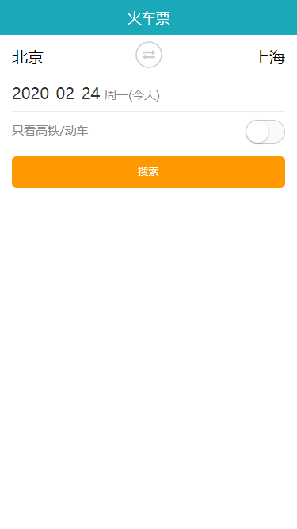
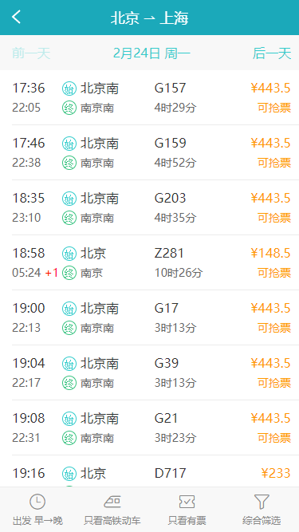
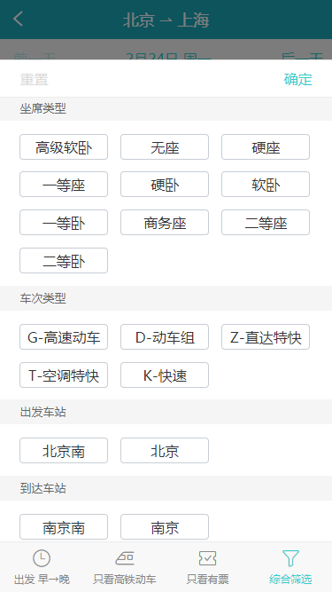
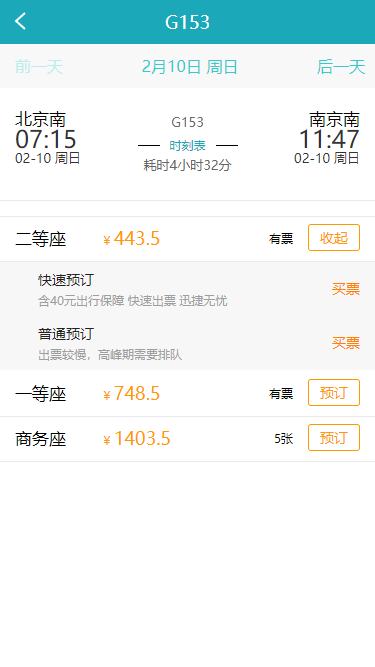
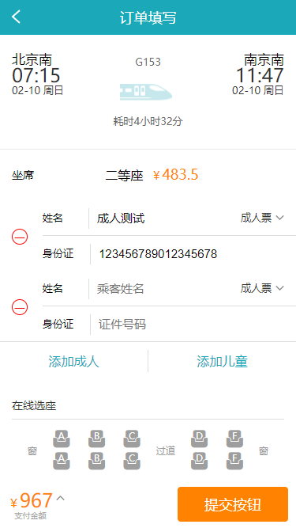

# 旅游电商网站火车票 PWA

## 项目描述

本项目使用 `React Hooks` 开发。项目开发包括火车票首页、搜索结果页、订票页面、订单页面。

## 如何运行

- 克隆代码：`https://github.com/ReactToLRH/react-train-ticket.git`
- 安装依赖：`npm install`
- 客户端运行：`npm run start`
- 服务端运行：`node .\server\bin\www`
- 打包：`npm run build`

## 基础知识

- [React 新特性](./readme/react_new.md)：`Context`与`ContextType`、`lazy`与`Suspense`、`memo`
- [React Hooks](./readme/react_hooks.md)
- [PWA](./readme/pwa.md)

## 使用插件/模块

- [dayjs](https://github.com/iamkun/dayjs/blob/dev/docs/zh-cn/README.zh-CN.md)：一个轻量的处理时间和日期的 JavaScript 库
- [classnames](https://github.com/JedWatson/classnames#readme)：在React项目更好地使用className
- [urijs](https://github.com/medialize/URI.js)：一个uri解析工具
- [left-pad](https://github.com/left-pad/left-pad#readme)：在字符串前填充特定字符到一定的长度

## 项目展示

